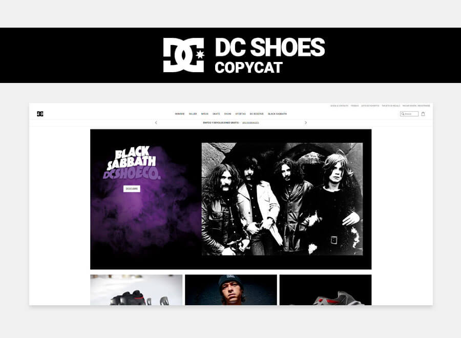

# DC Shoes España Copycat

Imitación de la web de [DC Shoes España](https://www.dcshoes.es/) como práctica.

## Autor ✒️
**Miriam Andrés** - *Documentación y trabajo inicial*
* [Github](https://github.com/miriandres)
* [LinkedIn](www.linkedin.com/in/miriamandresdev)

## Live Site Url
Puedes ver el proyecto en directo aquí [https://miriandres.github.io/DC-Shoes-Copycat/](https://miriandres.github.io/DC-Shoes-Copycat/)

## Instalación 
Este proyecto no necesita de instalación. Simplemente abre la carpeta o haz doble click en el .html

## Construido con 🛠️
* HTML5
* CSS custom properties
* SASS
* VanillaJS
* BEM Naming Convention
  
## Contratación
Si quieres contratarme puedes escribirme a hello@miriamandres.com para consultas.

## Licencia 📄
MIT Public License v3.0
No puede usarse comercialmente.